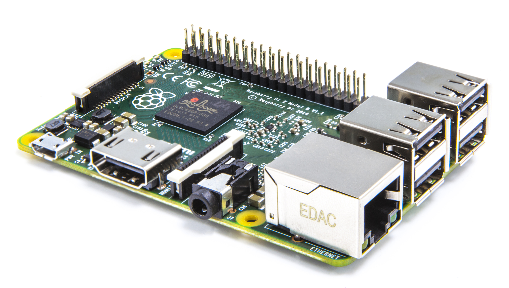

# IoT Development Challenge

Ce repository contient l'ensemble des éléments pour le concours de développement IoT : 
- Le fichier Swagger décrivant l'interface REST à développer.
- Les scripts Gatling d'injection pour les performance (en cours).

Rendez-vous sur http://editor.swagger.io/#/ pour générer le code serveur qui absorbera les 100 000 messages.

# FAQ

###### Quel niveau de persistance est attendu ?  Doit-on, à minima, persister l’ensemble des données reçues sur la carte SD ? 

Oui. L'ensemble des données reçues doivent être stockées sur la carte SD. 

###### Doit-on également persister la synthèse  ?

Pas forcement. Cependant un reboot doit permettre de la calculer.

###### Les requêtes doivent être traitées de manière synchrone : Quand l’appli dit « 200 OK », les données de la requête sont traitées et incluses dans la synthèse si elle est demandée. L’ordre des traitements entre les requêtes est-il important ? En particulier entre deux requêtes d’un même capteur ?

Non l'ordre n'a pas d’importance. Cependant l’identifiant du message doit être vérifié. Chaque message reçu doit être unique. Le service de synthèse doit être en mesure de restituer la synthèse des messages reçus lors de l'appel au service.

###### Quel est le livrable ? Une carte SD avec tout dessus 

Une carte de bonne facture sera acquise sur chaque site. Vous pouvez venir avec votre carte micro-sd ou venir avec un dump de la carte. Les tests finaux seront réalisés avec la même carte pour plus d'équité.

###### L’appli doit-elle booter avec le raspberry ?

Oui, complètement. Le serveur doit écouter sur le port 80 et le chemin des services doit être celui du fichier Swagger. 
Le raspberry doit avoir comme IP :  192.168.1.1 / 255.255.255.0

###### Le choix de l’OS est-il libre ?

Oui, à vous de choisir ! Soyez audacieux !

###### Les temps de tirs de test des équipes seront-ils échangés entre les équipes pour se challenger ?

Oui, on va essayer de mettre une page Web pour partager les résultats au fur et à mesure de l'avancement des équipes. Le script Gatling postera les résultats quand des tirs seront effectués.

###### Y-a-t'il une tolérance sur le choix de la carte SD pour la livraison ? 

Nous utiliserons des cartes de bonne capacité en lecture / écriture. La finale sera réalisée sur la même carte pour plus d’équité.
Les tests intermédiaires peuvent être réalisés sur vos propres cartes si vous le souhaitez.

###### Quel est le format de la date du timestamp du message ? 

Le timestamp est un DateTime RFC3339 : 1985-04-12T23:20:50.52Z

###### Quelle est la taille max de l'identifiant du message ? 

64 caractères.

###### Peut avoir quelques infos sur le scénario du test ainsi que sur le nombre d'utilisateurs max en parallèle?

Le scénario de test enchainera écritures et lectures de synthèses. 10 injecteurs seront lancés, chaque injecteur écrira 10 000 messages.

###### Doit-on vérifier l'unicité de l'identifiant du message et renvoyer une erreur dans le cas d'un POST double ?  Est-ce obligatoire ou pas ?

Bonne remarque, c’est effectivement pertinent de rendre obligatoire la vérification de l’unicité de l’identifiant. Un second message portant le même identifiant qu’un identifiant préalablement reçu ne doit pas être pris en compte par la gateway.

###### Est-ce que /messages/synthesis doit renvoyer un tableau avec une entrée "synthesis" par type de capteur ?

Oui, une entrée "synthesis" doit être retournée par type de capteur.

###### Est-ce le timestamp des messages qui doit être utilisé ou la date de prise en compte dans le serveur ?

Le Timestamp du message fait foi. La date de prise en compte de la demande de synthèse - 60 minutes.

###### Combien de types de capteurs sont à gérer ?
int32 ;-) 

###### Quel est le niveau de précision à gérer sur la moyenne dans le service de synthèse ? 
Deux décimales après le '.' seront suffisantes.
